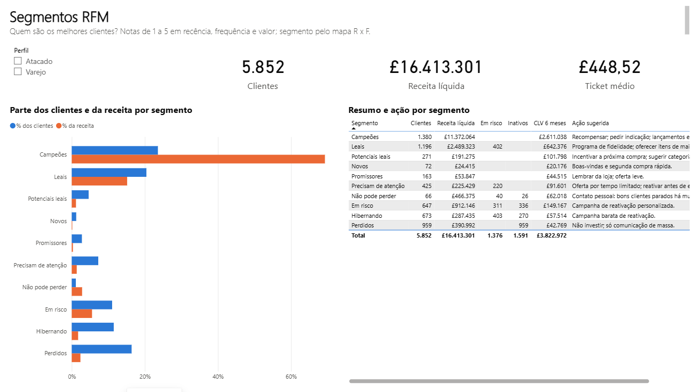
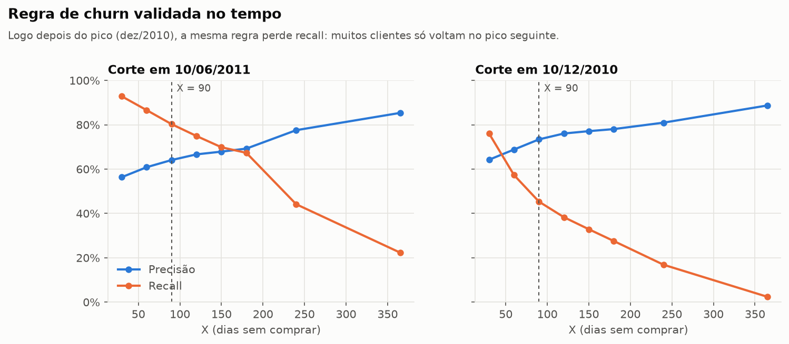
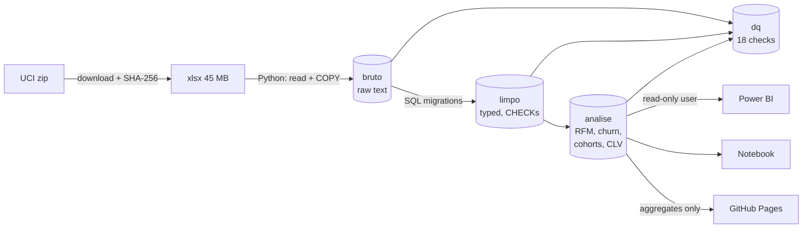
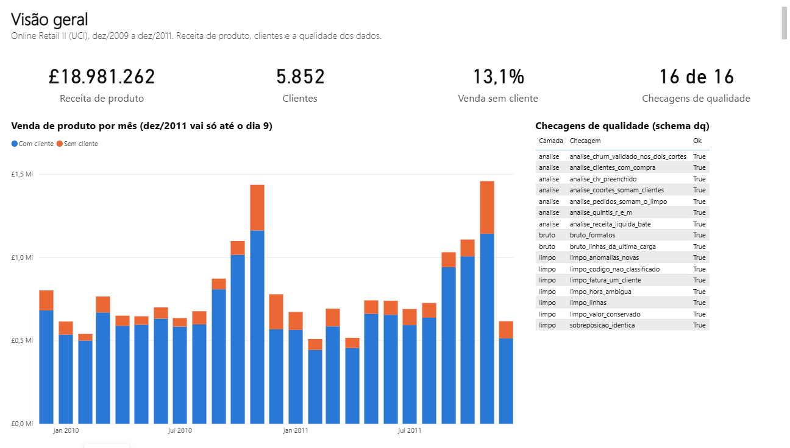
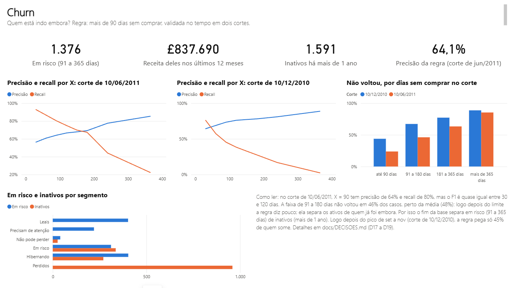
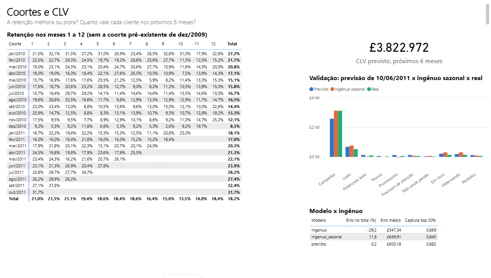

# Customer Analytics: Online Retail II

**Who are the best customers, who is leaving, and what are they worth?** RFM segmentation, churn validated back in time, retention cohorts and customer lifetime value for a real UK-based online retailer, built with PostgreSQL, SQL, Python and Power BI.

## 🔗 Access the project

[](https://diegosantiago1.github.io/customer-analytics-online-retail/)
[](https://diegosantiago1.github.io/Portifolio/#projetos)

**Direct link:** https://diegosantiago1.github.io/customer-analytics-online-retail/

An interactive page in English and Portuguese that opens in the browser, with nothing to install. Arrow keys move chapter by chapter.

[Português](README.pt-BR.md) · [Decisions and measurements](docs/DECISOES.md) · [Power BI report](docs/POWERBI.md) · [Notebook](notebooks/customer_analytics.ipynb)



## The business

An online-only shop based in the UK (the source keeps its name anonymous) that sells gifts and homewares: 4,895 products at a typical £2.10 a unit, such as a three-tier cake stand, a hanging heart T-light holder, jumbo shopping bags and party bunting.

- **Who buys:** many customers are shops that resell. The typical order has 15 different products and costs £303 (medians). The 607 wholesale customers (10%) bring 38% of net revenue.
- **Where:** 91% of the customers are in the UK. The rest are spread across 40 other countries, mostly in Europe.
- **When:** sales peak from September to November, when shops stock up for Christmas. November was the best month in both years, at about £1.4m.

A CRM team at a business like this needs to know whom to reward, whom to win back and what each customer is worth. Those are the questions below.

## The answers

| Question | Answer | How it was checked |
|---|---|---|
| **Who are the best customers?** | **Champions are 24% of the 5,852 customers and bring 69% of attributable net revenue.** The top 10% of customers bring 63%. 72% bought at least twice. | RFM scores computed in SQL; ties always get the same score |
| **Who is leaving?** | **1,376 customers are at risk** (91–365 days without buying). Their last-12-month revenue was **£838k**. Another 1,591 have not bought for over a year: they already left. | The rule was applied at a past cut-off using only data available then, and compared with who actually came back |
| **Is retention getting better or worse?** | **About one in five customers buys again the next month** (21% in month 1, 18% in month 6). Whether it is improving **cannot be said** from two years of data: early cohorts are mixed with returning customers, and seasonality moves month 1. | Monthly cohorts with window functions, checked for left censoring |
| **What is each customer worth?** | **£3.82m expected in the next 6 months.** The top 20% of customers by predicted value hold 74% of it. | A forecast made in June 2011 beat a seasonal naive forecast on total error, per-customer error and ranking |

## What to do first

The £838k at risk is not spread evenly. **Almost half of it (£401k) sits with 402 Loyal customers** who have gone more than 90 days without buying. They are the cheapest to win back, because they bought often until recently.

| Priority | Who | Revenue at risk (last 12 months) | Suggested action |
|---|---|---:|---|
| 1 | Loyal customers gone quiet (402) and "Can't lose" (40) | £401k + £44k | Personal contact before they drift further |
| 2 | At risk (311), Hibernating (403), Need attention (220) | £393k | Reactivation campaign, cheapest channel first |
| Keep | Champions (1,380) | none at risk today | Rewards, early access to new ranges, referrals |
| Do not chase | Lost (959): more than a year without buying | — | Mass communication only |

A caveat from the validation: about half of the customers 91–180 days quiet come back on their own. A campaign should be measured against a control group, not against zero.

## What makes it more than a tutorial

**1. Measured before cleaning.** The dataset has 34,335 exactly duplicated lines. The usual move is `drop_duplicates()`. Measuring first showed two different things:
- **22,523 lines are an export artefact.** The two sheets of the Excel file overlap from 1 to 9 Dec 2010, and that period is identical in both, down to the repeated lines. The overlap is removed.
- **The other 11,812 look like real purchases and were kept.** 86% of them are on non-adjacent lines of the same invoice. In 10,967 invoice/product pairs, the same product appears again with a different quantity. This is consistent with the till recording an item added twice to the same order. They are worth £57k (0.3% of sales). ([D4, D5](docs/DECISOES.md))

**2. Churn validated over time, including where it has no signal.** "More than 90 days without buying" was tested at a past cut-off (June 2011): 64% of the flagged customers really did not come back, and the rule caught 80% of those who left. The F1 is almost flat between 30 and 120 days, so 90 was kept because it is easy to act on. Looking by recency band shows where the signal is:
- customers 91–180 days without buying did not come back 46% of the time, about the same as the average customer (48%);
- the rule mostly separates the active (24% did not come back) from those already gone (85% over a year).

That is why the report splits **at risk** from **inactive**. Right after the Sep–Nov peak the rule also catches only 45% of leavers, because many customers only return at the next peak. ([D17–D19](docs/DECISOES.md))



**3. CLV checked against what actually happened, against a fair baseline.** The forecast fits in one line:

> active probability by segment × average order value × purchases per month × months

Two choices make it work:
- The active probability is measured in **the same season one year earlier**, because seasonality is strong.
- New customers' purchase rate is smoothed toward the average (Gamma-Poisson). Without this, the forecast for "New" customers came out at 2.8× reality.

| Model (forecast made on 10 Jun 2011, 6 months) | Error on total | Mean abs. error per customer | Top-20% capture |
|---|---:|---:|---:|
| **This model** | **+0.2%** | £603 | **0.882** |
| Seasonal naive (same window one year earlier) | +11.8% | £650 | 0.845 |
| Naive (repeat the previous 6 months) | −29.2% | **£547** | 0.869 |

The model beats the seasonal naive forecast on all three measures. The +0.2% on the total should not be read as precision:
- errors partly offset each other: by segment, the bias goes from −17% (Champions) to +199% ("Can't lose");
- the smoothing parameter was chosen on this same cut-off, and its sensitivity is published.

([D23–D25](docs/DECISOES.md))

**4. Reviewed before publishing.** Three independent reviews (engineering, QA, data methodology) re-queried every headline number. None was wrong, but the reviews found real problems, all fixed and listed in [D27](docs/DECISOES.md):
- a time-zone bug: the result depended on the session's time zone;
- a misleading claim that acquisition fell 36%, which was really left censoring;
- a misleading churn headline;
- a weak baseline;
- gaps in tests.

**5. Every number is reproducible and tested.**
- The raw file is downloaded and verified by SHA-256.
- Every rule is a versioned SQL migration.
- **280 automated tests** cover the rules, including hostile inputs and 4 session time zones. One end-to-end test reruns the whole pipeline on the real file and checks the published numbers.
- A data-quality schema runs **18 checks**. If any fails, the whole pipeline is rolled back and the site export refuses to run.
- Every number in the Power BI report was checked against SQL ([table](docs/POWERBI.md#conferência-contra-o-sql)).

## Architecture



- **The SQL does the maths, Python orchestrates.** Each step rebuilds its own schema from the previous one, in one transaction (`python -m varejo.processar`).
- **Point-in-time functions.** `analise.metricas_cliente(date)` and `analise.rfm(date)` only see orders before the date, so validation uses exactly the same code as the final analysis and cannot look into the future (tested).
- **Time zone fixed at the source and in the functions.** Invoice times are UK local time, stored as `timestamptz`. Every pipeline function runs with `SET timezone = 'Europe/London'`, so the result does not depend on who runs it.
- **Least privilege.** Power BI connects with a user that only reads the `analise` and `dq` schemas (tested).

| Overview | Churn | Cohorts and CLV |
|---|---|---|
|  |  |  |

## Data

[Online Retail II](https://archive.ics.uci.edu/dataset/502/online+retail+ii), UCI Machine Learning Repository (Chen, 2012), licence CC BY 4.0. It covers a UK-based online retailer of gifts and homewares, many of its customers wholesalers, from 1 Dec 2009 to 9 Dec 2011: 1,067,371 invoice lines in two sheets.

The code, tables and columns are in **Portuguese** (the author's language). The data dictionary:

| Original | In this project | | Schema / object | Meaning |
|---|---|---|---|---|
| Invoice | `fatura` | | `bruto` | raw sheet as text |
| StockCode | `codigo_produto` | | `limpo` | cleaned and typed lines |
| Description | `descricao` | | `analise` | analysis (orders, customers, RFM, churn, cohorts, CLV) |
| Quantity | `quantidade` | | `dq` | data-quality checks |
| InvoiceDate | `data_fatura` | | `pedido` / `cliente` | order / customer |
| Price | `preco_unitario` | | `receita_liquida` | net revenue: product sales − product cancellations |
| Customer ID | `cliente_id` | | `segmento` / `status_churn` | RFM segment / active, at risk, inactive |
| Country | `pais` | | `coorte_retencao` | retention cohort |

## Run it

Requirements: Python 3.14, Docker and, for the report, Power BI Desktop. Clone it **outside** a synced folder such as OneDrive (it locks files in `.venv` and `data/`).

```bash
python -m venv .venv
source .venv/bin/activate              # Windows PowerShell: .venv\Scripts\Activate.ps1
pip install -r requirements-dev.txt     # run from the project folder (installs the package with -e .)
cp .env.example .env                    # PowerShell: Copy-Item .env.example .env  -> then set the passwords
docker compose up -d                    # PostgreSQL 16 on 127.0.0.1:5432 (docker-compose.yml)
python -m varejo.bootstrap              # project user + databases, via docker exec (no superuser password stored)
alembic upgrade head                    # schemas, rules and functions (10 migrations)
python -m varejo.baixar_dados           # downloads the xlsx and checks SHA-256
python -m varejo.carga                  # 1,067,371 lines into bruto (~30 s)
python -m varejo.processar              # limpo -> analise -> dq (~30 s); rolls back if a check fails
python -m varejo.exportar_site          # site/dados.json (refuses if dq failed)
python -m http.server 8000 -d site      # the interactive page at http://127.0.0.1:8000 (arrow keys move chapter by chapter)
pytest                                  # 280 tests (-m "not lento" skips the 2 on the real file)
```

Then open `powerbi/customer_analytics.pbip` ([connection steps](docs/POWERBI.md)) or run the notebook. The report reads the database `retail` on `127.0.0.1`. If you change `VAREJO_DB_NAME`, regenerate it with `python powerbi/gerar_pbip.py`. The page in `site/` is deployed to GitHub Pages by `.github/workflows/pages.yml` (Settings → Pages → Source: GitHub Actions).

```
src/varejo/        download, load, pipeline runner, charts, site export
db/migracoes/      10 Alembic migrations (hand-written SQL)
tests/             280 pytest tests (cleaning, RFM, churn, cohorts, CLV, dq, time zones, views, BI)
notebooks/         analysis notebook (reads views only) and its generator
powerbi/           PBIP report (TMDL + PBIR), generated by gerar_pbip.py
site/              static page for GitHub Pages
docs/              PLAN, DECISOES (every decision with its measurement), POWERBI
```

## Limitations and next steps

- **Churn.** A fixed-X rule says little just past the threshold and loses recall right after the peak. Next step: a per-customer threshold based on each customer's own purchase interval, or a model that sees the season.
- **CLV.** The formula counts inactivity twice (active probability × an average rate that already includes inactive months), which the smoothing partly compensates. The bias by segment is large. BG/NBD + Gamma-Gamma would model this properly. The horizon is 6 months, because 12 cannot be validated with two years of data.
- **Retention trend.** It cannot be assessed with two years and left-censored early cohorts.
- **Definitions.** Frequency counts invoices, so same-day invoices count twice. Manual credits ("M") inside cancellation invoices are not netted. The wholesale flag (≥ 400 units per order on average, about the top 10%) is a proxy. 13% of product sales have no customer ID.

---

Diego Freitas Santiago · data analyst · [GitHub](https://github.com/DiegoSantiago1)
