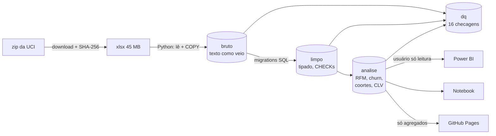

# Customer Analytics: Online Retail II

**Quem são os melhores clientes, quem está indo embora e quanto eles valem?** Segmentação RFM, churn validado no tempo, coortes de retenção e valor do cliente (CLV) para uma varejista online real de Londres, com PostgreSQL, SQL, Python e Power BI.

[English](README.md) · **[Página interativa](https://diegosantiago1.github.io/customer-analytics-online-retail/)** · [Decisões e medições](docs/DECISOES.md) · [Relatório Power BI](docs/POWERBI.md) · [Notebook](notebooks/customer_analytics.ipynb)


## As respostas

| Pergunta | Resposta | Como foi conferido |
|---|---|---|
| **Quem são os melhores clientes?** | **Os Campeões são 24% dos 5.852 clientes e trazem 69% da receita líquida.** Os 10% maiores trazem 63%. 72% compraram ao menos duas vezes. | Notas RFM calculadas em SQL; empates sempre com a mesma nota |
| **Quem está indo embora?** | **2.967 clientes (51%)** estão há mais de 90 dias sem comprar. Eles gastaram **£835 mil** nos últimos 12 meses. | A regra foi aplicada numa data de corte passada, só com o que se sabia naquele dia, e comparada com quem de fato voltou |
| **A retenção melhora ou piora?** | **Estável**: cerca de 21% de cada coorte volta a comprar no mês 1 e 18% no mês 6, nos dois anos. O que caiu foi a **entrada de clientes novos** (set a nov: 940 em 2010, 600 em 2011, −36%). | Coortes mensais com window functions |
| **Quanto vale cada cliente?** | **£3,81 mi esperados nos próximos 6 meses.** Os 20% de clientes com maior valor previsto concentram 74% disso. | A mesma previsão feita em junho de 2011 errou o total real em **+0,5%**. Um modelo ingênuo ("repete os últimos 6 meses") errou em −29% |

## O que faz disto mais que um tutorial

**1. Medir antes de limpar.** O dataset tem 34.335 linhas idênticas a outra. O gesto comum seria um `drop_duplicates()`. Medir antes mostrou que são duas coisas diferentes:
- **22.523 são artefato da exportação.** As duas abas do Excel se sobrepõem de 1 a 9 de dezembro de 2010, e esse período é idêntico nas duas, até nas linhas repetidas. A sobreposição é removida.
- **As outras 11.812 são compras reais.** 86% delas estão em linhas não vizinhas da mesma fatura. Em 10.967 pares fatura+produto, o mesmo produto aparece de novo com outra quantidade. É o jeito do sistema de registrar o item adicionado duas vezes no pedido. Apagar essas linhas teria removido £57 mil de vendas reais. ([D4, D5](docs/DECISOES.md))

**2. Churn validado no tempo, inclusive onde ele falha.** No corte de junho de 2011, "mais de 90 dias sem comprar" teve o melhor F1 (0,71) entre 90, 120 e 180 dias: 64% dos marcados de fato não voltaram, e a regra pegou 80% de quem foi embora. Repetindo o teste logo depois do pico de set a nov (dez/2010), a mesma regra pega só 45%, porque muitos clientes só voltam no pico seguinte. A limitação é medida e mostrada no relatório, não escondida. ([D17, D18](docs/DECISOES.md))


**3. CLV conferido contra o que de fato aconteceu.** A previsão é simples o bastante para caber numa linha:

> probabilidade de seguir ativo por segmento × ticket médio × compras por mês × meses

O que faz ela funcionar:
- A probabilidade é medida **na mesma época do ano anterior**, porque a sazonalidade é forte.
- A taxa de compra de clientes novos é suavizada em direção à média (Gamma-Poisson). Sem isso, a previsão dos "Novos" saía 2,8 vezes o real.

| Modelo (previsão feita em 10/06/2011, 6 meses) | Erro no total | Erro médio por cliente | Captura do top 20% |
|---|---:|---:|---:|
| **Este modelo** | **+0,5%** | £604 | **0,883** |
| Ingênuo (repete os 6 meses anteriores) | −29,2% | **£547** | 0,869 |

O ingênuo ganha no erro por cliente, e isso também está reportado. ([D23 a D25](docs/DECISOES.md))

**4. Todo número é reproduzível e testado.**
- A planilha é baixada e conferida por SHA-256.
- Cada regra é uma migration SQL versionada.
- **227 testes automatizados** cobrem as regras, entre eles casos hostis. Um teste ponta a ponta roda o pipeline inteiro sobre a planilha real e confere os números publicados no [DECISOES.md](docs/DECISOES.md).
- Um schema de qualidade de dados roda **16 checagens** (totais batendo entre as camadas, premissas medidas que continuam valendo), e o pipeline falha se alguma quebrar.
- Cada número do Power BI foi conferido contra o SQL ([tabela](docs/POWERBI.md#conferência-contra-o-sql)).

## Arquitetura



- **O SQL faz as contas, o Python orquestra.** O Python só baixa, carrega e chama as funções SQL. Cada etapa reconstrói o próprio schema a partir do anterior (`python -m varejo.processar`), numa transação só.
- **Funções numa data de referência.** `analise.metricas_cliente(data)` e `analise.rfm(data)` só enxergam pedidos anteriores à data. A validação usa exatamente o mesmo código da análise final e não tem como olhar o futuro, e um teste garante isso.
- **Menor privilégio.** O Power BI conecta com um usuário que só lê os schemas `analise` e `dq` e não consegue rodar nenhuma recarga (testado).
- **Fuso na origem.** O horário das faturas é local do Reino Unido, convertido com `AT TIME ZONE 'Europe/London'` para `timestamptz`. Um teste cobre a troca entre BST e GMT.

| Visão geral | Churn | Coortes e CLV |
|---|---|---|
|  |  |  |

## Dados

[Online Retail II](https://archive.ics.uci.edu/dataset/502/online+retail+ii), UCI Machine Learning Repository (Chen, 2012), licença CC BY 4.0. É uma varejista online do Reino Unido de presentes e utilidades, com muitos clientes atacadistas, de 01/12/2009 a 09/12/2011: 1.067.371 linhas de fatura em duas abas.

Código, tabelas e colunas estão em português. O dicionário dos nomes originais está no [README em inglês](README.md#data).

## Como rodar

Requisitos: Python 3.14, Docker (container PostgreSQL 16) e, para o relatório, Power BI Desktop.

```bash
python -m venv .venv && .venv/Scripts/pip install -r requirements-dev.txt
cp .env.example .env                 # defina as senhas
python -m varejo.bootstrap           # usuário + bancos (via docker exec, sem guardar senha de superusuário)
alembic upgrade head                 # schemas, regras e funções (9 migrations)
python -m varejo.baixar_dados        # baixa o xlsx e confere o SHA-256
python -m varejo.carga               # 1.067.371 linhas no bruto (~30 s)
python -m varejo.processar           # limpo -> analise -> dq (~30 s); falha se uma checagem falhar
python -m varejo.exportar_site       # site/dados.json
pytest                               # 227 testes (-m "not lento" pula os 2 com a planilha real)
```

Depois, abra `powerbi/customer_analytics.pbip` ([passo a passo da conexão](docs/POWERBI.md)) ou rode o notebook.

## Limitações e próximos passos

- **Sazonalidade.** A regra de churn com X fixo perde recall logo depois do pico. O próximo passo é um limite por cliente, baseado no intervalo típico de compra de cada um, ou um modelo que enxergue a época do ano.
- **Horizonte do CLV.** É de 6 meses, porque 12 meses não teriam como ser validados com dois anos de dados.
- **O flag de atacado é uma aproximação.** Significa ≥ 400 unidades por pedido em média (cerca dos 10% maiores), porque os dados não dizem quem é atacadista.
- **Sem atribuição.** 13% da venda de produto não tem cliente identificado e fica fora das análises de cliente.
- **Extensões possíveis.** BG/NBD + Gamma-Gamma para o CLV, um classificador de churn comparado à regra, análise de cesta.

---

Diego Freitas Santiago · analista de dados · [GitHub](https://github.com/DiegoSantiago1)
