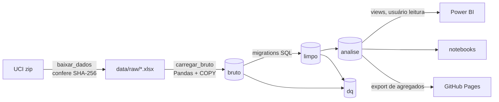

# Plano do projeto — Customer Analytics (Online Retail II)

> Documento da fase de planejamento. Descreve o que **seria** construído. Os números citados aqui vêm de uma medição exploratória (03/10/2026, script descartável) e foram refeitos com script versionado antes de qualquer uso no README.
>
> **Estado: implementado (T1 a T13).** Os pontos em que a implementação diferiu do plano, cada um com o motivo medido, estão em [DECISOES.md](DECISOES.md): leitura com calamine em vez de openpyxl (D1); repetições dentro da aba mantidas, porque não são duplicatas (D5); notas RFM por `percent_rank` em vez de `NTILE` (D13); horizonte do CLV de 6 meses em vez de 12 (D25); `dq` feito depois das análises, para cobrir também o schema `analise`.

## 1. Problema

Uma varejista online do Reino Unido vende presentes e utilidades para clientes finais e para muitos atacadistas (lojas que revendem). Entre dez/2009 e dez/2011 foram cerca de 1 milhão de linhas de fatura.

A gerência de marketing/CRM quer responder quatro perguntas:

1. **Quem são os melhores clientes?** Segmentação RFM (recência, frequência, valor).
2. **Quem está indo embora?** Churn por regra, validada no tempo.
3. **Quanto vale cada cliente?** CLV histórico e preditivo simples.
4. **A retenção melhora ou piora?** Coortes pelo mês da primeira compra.

## 2. Dados

- **Fonte:** [Online Retail II](https://archive.ics.uci.edu/dataset/502/online+retail+ii), UCI Machine Learning Repository, id 502, licença **CC BY 4.0**. Dados reais, de uma empresa real, anonimizados (o cliente é só um número).
- **Arquivo:** `online_retail_II.xlsx` (45,6 MB, 2 abas). Não vai para o git: o script `baixar_dados` baixa o zip da UCI e confere o SHA-256 (`bcbe73b3…2df2e980`).
- **Colunas originais → nomes no projeto:**

| Original | Projeto | Observação |
|---|---|---|
| `Invoice` | `fatura` | Prefixo `C` = cancelamento; `A` = ajuste de dívida |
| `StockCode` | `codigo_produto` | Inclui códigos que não são produto (POST, M, D…) |
| `Description` | `descricao` | Tem valores numéricos misturados; carregar como texto |
| `Quantity` | `quantidade` | Negativa nos cancelamentos |
| `InvoiceDate` | `data_fatura` | Horário local do Reino Unido, sem fuso |
| `Price` | `preco_unitario` | Em libras (£) |
| `Customer ID` | `cliente_id` | Nulo em 22,8% das linhas |
| `Country` | `pais` | 43 países; Reino Unido ≈ 92% das linhas |

O README em inglês traz esta tabela como dicionário de nomes, porque o código está em português.

## 3. Decisões de escopo

| Tema | Decisão |
|---|---|
| Identidade | Projeto **só de análise**: PostgreSQL, SQL, Python (Pandas/NumPy), notebooks e Power BI. Sem API e sem telas. |
| Teto | **50 a 60 h** no total. Se uma tarefa estourar a estimativa em mais de 50%, revisar o escopo antes de seguir. |
| Idioma | Código, banco e commits em português. `README.md` em inglês e `README.pt-BR.md`. |
| Período | Dez/2009 a dez/2011 (os dois anos). |
| Banco | `retail` + `retail_teste` no container compartilhado `honda-vendas-db`, com usuário próprio e um usuário somente leitura para o Power BI. |
| Divisão do trabalho | **O SQL faz as contas e o Python orquestra.** O Python lê o xlsx e carrega o bruto. Limpeza, RFM, churn, coortes e CLV ficam em SQL versionado. Os notebooks só exploram e mostram. |
| ML | Nenhum. Churn por regra, RFM por quintis e CLV por fórmula. BG/NBD e K-means ficam em "próximos passos". |
| Publicação | Repositório local desde o início; o Diego cria o repositório público `customer-analytics-online-retail` no fim. Página estática no GitHub Pages (última tarefa, a primeira a ser cortada; plano B: capturas + PDF). |

## 4. Arquitetura



### Estrutura de pastas

```
customer-analytics-online-retail/
├── src/varejo/            pacote Python (baixar_dados, carregar_bruto, bootstrap, config)
├── db/bootstrap.sql       role + bancos (superusuário, via docker exec)
├── db/migracoes/          Alembic: cada migration é SQL explícito
├── tests/                 pytest (banco retail_teste recriado a cada execução)
├── notebooks/             exploração e gráficos
├── powerbi/               relatório em PBIP (TMDL + PBIR)
├── site/                  página estática do GitHub Pages
├── docs/                  PLAN.md, DECISOES.md, POWERBI.md
└── data/raw/              fora do git
```

Stack (a mesma do Projeto 2, sem dependência nova): Python 3.14, pandas, numpy, SQLAlchemy, psycopg 3, Alembic, python-dotenv, matplotlib, openpyxl (para ler o xlsx; é a única adição), pytest, ruff, mypy.

## 5. Modelo de dados

### 5.1 `bruto`
`bruto.fatura_linha`: as 8 colunas como **texto**, mais `aba` (de qual aba veio) e `linha_origem` (número da linha na planilha). Sem restrição nenhuma: é a foto fiel da fonte, usada para conferir as contagens e para o `dq`.

### 5.2 `limpo`

| Tabela | Conteúdo | Regras no banco |
|---|---|---|
| `codigo_nao_produto` | Lista explícita (POST, DOT, M, D, C2, S, BANK CHARGES, ADJUST, AMAZONFEE, padrões `gift_%`, `DCGS%`, PADS…) com `tipo` (frete, taxa, desconto, manual, ajuste) e o motivo | PK no código; tipo restrito por `CHECK` |
| `fatura_linha` | Linhas deduplicadas e tipadas; `data_fatura TIMESTAMPTZ` interpretada como `Europe/London`; `eh_cancelamento`, `eh_produto` | `CHECK` de sinal: venda com `quantidade > 0`, cancelamento com `quantidade < 0`; `preco_unitario >= 0`; `UNIQUE` na chave de deduplicação |
| `cliente` | Um registro por `cliente_id`: país principal, primeira e última compra | PK |

**Regras de limpeza** (cada uma tem um teste com caso hostil e uma entrada em `DECISOES.md`):

1. **Deduplicar.** As abas se sobrepõem de 01 a 09/12/2010, e há duplicatas exatas dentro de cada aba (34.335 no total). A chave é a linha inteira. Teste: a mesma linha nas duas abas entra uma vez só.
2. **Sem cliente.** As linhas sem `cliente_id` ficam em `limpo.fatura_linha` (a receita total precisa bater com a fonte), mas ficam fora de RFM, churn, CLV e coortes. A visão geral mostra a "receita não atribuível" (~£3,07 mi medidos).
3. **Cancelamentos.** São abatidos da receita do cliente: o valor do RFM e o CLV usam a **receita líquida**. A taxa de cancelamento por cliente vira uma métrica. Ponto aberto, a medir na T3: cancelamentos cuja venda original é anterior a dez/2009 podem deixar a receita líquida ≤ 0. Proposta: manter o número real e tirar esses clientes dos quintis de valor, com a contagem reportada.
4. **Códigos que não são produto.** Ficam fora da receita de produto e são reportados à parte (frete, taxas). As faturas `A` (ajuste de dívida) também ficam fora.
5. **Quantidade ou preço zerados/negativos fora dos cancelamentos.** São excluídos e contados no `dq`.
6. **Fuso.** `ALTER DATABASE retail SET timezone = 'Europe/London'`. Teste: um horário na madrugada da troca de horário de verão (fim de outubro) não quebra nem duplica.

### 5.3 `analise`

| Objeto | O que entrega |
|---|---|
| `pedido` | Uma linha por fatura de cliente: data, receita líquida de produto, itens e se é cancelamento |
| `cliente_rfm(data_ref)` | Função: recência, frequência, valor, quintis `NTILE(5)`, segmento e flag de atacado, calculados numa data de referência. Pode ser calculado no fim da base (10/12/2011) ou na data de corte (09/06/2011) |
| `segmento_rfm` | Mapa R×F → segmento (tabela de referência, editável e testada) |
| `intervalo_compra` | Dias entre pedidos consecutivos do mesmo cliente (`LAG`) |
| `validacao_churn` | Para X = 90, 120 e 180: matriz de confusão, precisão e recall na data de corte |
| `coorte_retencao` | Mês da primeira compra × meses desde então × % ativos. Dez/2009 = "pré-existentes" |
| `cliente_clv` | CLV histórico e preditivo por cliente, mais a validação contra o real |
| `vw_*` | Views achatadas para o Power BI e para o export do site |

**Segmentos RFM (proposta inicial, ajustada na T5):**

| Segmento | Regra (R, F em quintis) |
|---|---|
| Campeões | R 4–5 e F 4–5 |
| Leais | R 3–5 e F 3–5 (fora dos Campeões) |
| Potenciais leais | R 4–5 e F 2–3 |
| Novos | R 5 e F 1 |
| Promissores | R 4 e F 1 |
| Precisam de atenção | R 3 e F 1–2 |
| Em risco | R 1–2 e F 3–5 |
| Hibernando / Perdidos | R 1–2 e F 1–2 |

**Flag de atacado:** a regra (ticket médio ou quantidade média por pedido acima de um percentil) é escolhida na T5 olhando a distribuição. O RFM é único; o flag vira filtro.

### 5.4 Churn e CLV (definições)

- **Churn:** um cliente está em churn se passou **X dias sem comprar**.
- **Validação temporal:** na data de corte de 09/06/2011, o cliente é marcado como churn com os dados até essa data. O "real" é não ter comprado de 09/06 a 09/12/2011.
  - **Precisão** = dos marcados, quantos de fato não voltaram.
  - **Recall** = dos que não voltaram, quantos foram marcados.
  - Comparamos X = 90, 120 e 180 e escolhemos um; a comparação inteira vai para o README.
- **CLV histórico:** a receita líquida acumulada.
- **CLV preditivo (horizonte de 12 meses):** ticket médio líquido × pedidos por mês × meses de vida esperada, limitados ao horizonte. A vida esperada vem de 1 / taxa mensal de churn do segmento.
- **Validação do CLV:** a previsão de 6 meses feita em 09/06/2011 é comparada à receita real até 09/12/2011. Métricas: erro absoluto médio e erro no total, mais a ordenação, ou seja, se o top 20% previsto captura a receita do top 20% real.

### 5.5 `dq`
Checagens no estilo do Projeto 2: uma tabela `dq.resultado` (checagem, esperado, obtido, ok) preenchida por uma função. Exemplos: as contagens do bruto batem com a planilha (1.067.371); não há linha duplicada no limpo; a receita do bruto = limpo + excluídas; todo cliente do RFM está em `limpo.cliente`; os quintis têm tamanhos próximos.

## 6. Power BI

Público: gerente de marketing/CRM. Lê as views `analise.vw_*` com o usuário somente leitura. Cada número é conferido contra o SQL antes de publicar (documentado em `docs/POWERBI.md`).

| Página | Conteúdo |
|---|---|
| Visão geral | Receita líquida, clientes, ticket médio, receita não atribuível, frete/taxas, sazonalidade mensal |
| Segmentos RFM | Tamanho e receita por segmento, filtro atacado/varejo, lista acionável de clientes |
| Churn | Clientes em risco, receita em risco, validação da regra (precisão/recall por X) |
| Coortes + CLV | Heatmap de retenção, distribuição e top de CLV, previsto × real |

## 7. Tarefas

### Critério de pronto
Implementado + executado + testado (inclusive com casos hostis) + corrigido + retestado + revisado + integrado. Antes de fechar cada fase: ruff → mypy → pytest. Checkpoint ao fim de cada fase e uma seção de aprendizado depois das grandes etapas. Commits pequenos (`feat:` / `fix:` / `test:` / `docs:`).

| # | Tarefa | Entrega | Horas |
|---|---|---|---|
| T0 | Plano | Este documento, revisado com o Diego | 2 (feito) |
| T1 | Ambiente | `git init`, `.venv`, requirements, pyproject (ruff/mypy/pytest), `.env.exemplo`, bootstrap do banco `retail` + `retail_teste` + usuário do BI | 3 |
| T2 | Download e carga do bruto | `baixar_dados` com SHA-256; `carregar_bruto` via COPY; **refazer as medições da seção 7.2 do contexto** e conferir se batem | 4 |
| T3 | Limpeza (`limpo`) | Migrations da seção 5.2; testes de cada regra com caso hostil; `DECISOES.md` | 6 |
| T4 | Qualidade (`dq`) | Checagens da 5.5 rodando e verdes | 3 |
| T5 | RFM + atacado | `cliente_rfm`, mapa de segmentos, regra do flag de atacado medida; testes com dados pequenos montados à mão | 5 |
| T6 | Churn | Intervalos, regra, validação 90/120/180, escolha do X documentada | 5 |
| T7 | Coortes | `coorte_retencao` com window functions; tratamento de dez/2009 | 4 |
| T8 | CLV | Histórico + preditivo + validação | 5 |
| T9 | Notebooks | Exploração e gráficos lidos das views (não recalculam nada) | 2 |
| T10 | Power BI | 4 páginas em PBIP; conferência número a número contra o SQL | 8 |
| T11 | Documentação | README em inglês e em português, `DECISOES.md`, `POWERBI.md`, seções de aprendizado | 4 |
| T12 | Revisões | Três revisões independentes (engenharia, QA, dados) + correções | 2 |
| | **Subtotal (núcleo)** | | **53** |
| T13 | GitHub Pages | Página estática com os gráficos principais, lida de um export de agregados. **A primeira a ser cortada** | 4 |
| | **Total** | | **57** |

Antes de implementar cada tarefa, aviso o que vou fazer e espero o ok.

## 8. Riscos

| Risco | Mitigação |
|---|---|
| Ler o xlsx de 45 MB é lento (~1 a 2 min) | Ler uma vez só e carregar o bruto; o resto roda em SQL |
| Receita líquida negativa por cancelamento sem venda de origem | Medir na T3 e decidir com o número em mãos (seção 5.2, regra 3) |
| Atacadistas distorcem o RFM | Flag de atacado como filtro; olhar os segmentos com e sem o flag |
| Dez/2011 incompleto (até o dia 09) | Marcar como mês parcial nos gráficos mensais; não comparar com os meses cheios |
| Sazonalidade (pico de set a nov) mascara o churn | A janela de validação de 6 meses inclui o pico; registrar a limitação no README |
| OneDrive trava `.git` | Conferir `git log --stat` depois de cada commit |
| Teto de horas estourado | Cortar a T13 primeiro e depois reduzir as páginas do BI |

## 9. Fora do escopo (próximos passos)
- BG/NBD + Gamma-Gamma para o CLV (`pymc-marketing`).
- Modelo de ML para o churn (regressão logística/árvores) comparado à regra.
- Análise de cesta (produtos comprados juntos).
- Pipeline agendado: isso é assunto do projeto de Data Platform.
